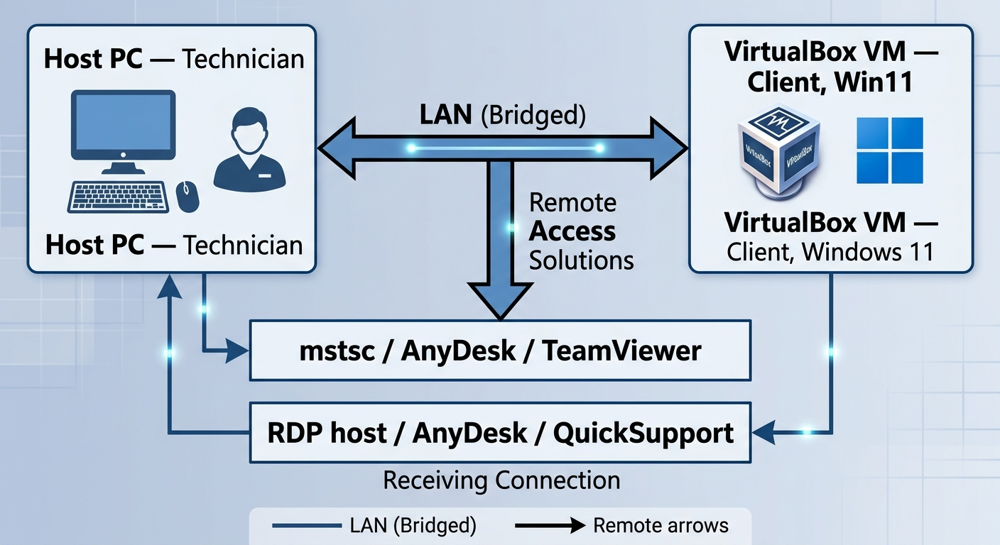

# 01-Lab Architecture

| Role | Machine | Details |
|---|---|---|
| Technician | Host PC | Windows, runs RDP client (`mstsc`), AnyDesk, and full TeamViewer |
| Client / End-user | VirtualBox VM | Windows 11, network adapter set to **Bridged** |

**Network Setup**: The VM's network adapter is set to **Bridged Adapter** in VirtualBox, so it receives an IP on the same LAN as the host rather than VirtualBox's internal NAT range. This makes the Vm behave like a genuinely separate device on the network, closer to a real remote-support scenario than a host-only/NAT setup would be.

> Note : TeamViewer (QuickSupport included) conect through TeamViewer's relay servers rather than directly over the LAN, so it works regardless of the network mode, a useful contrast point when comparing tools