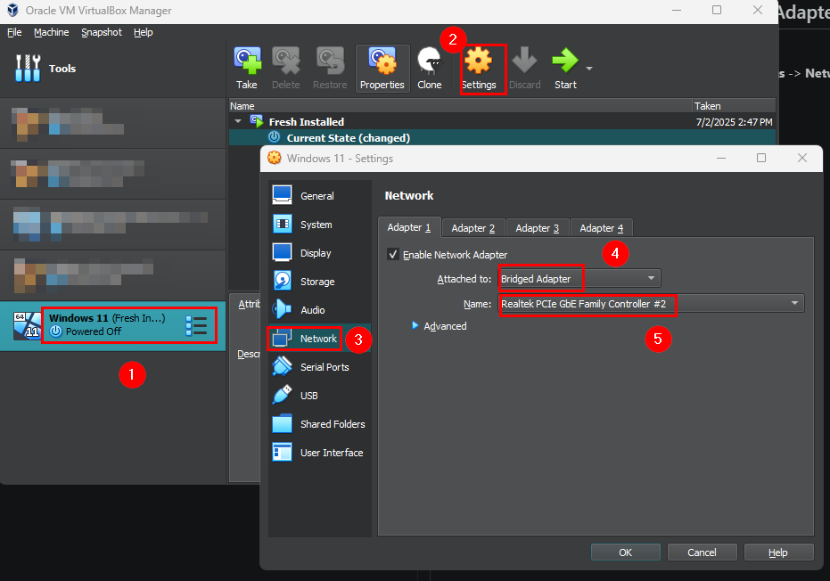
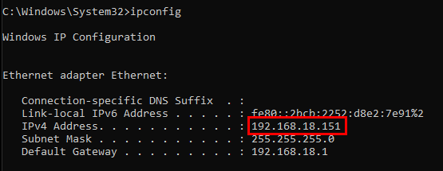
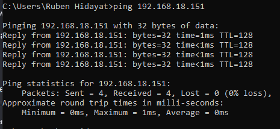
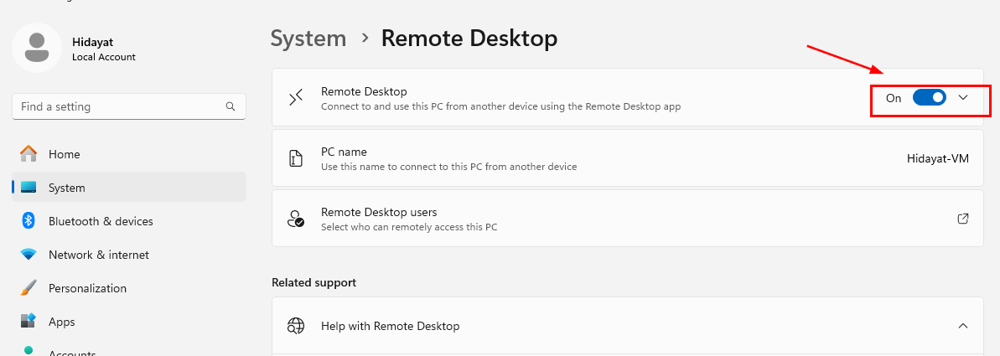
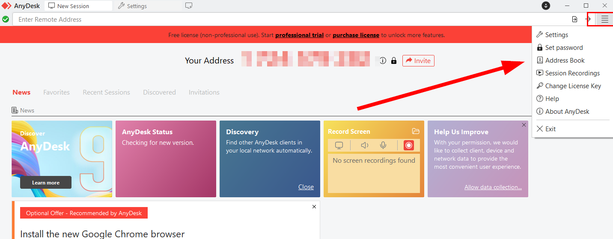
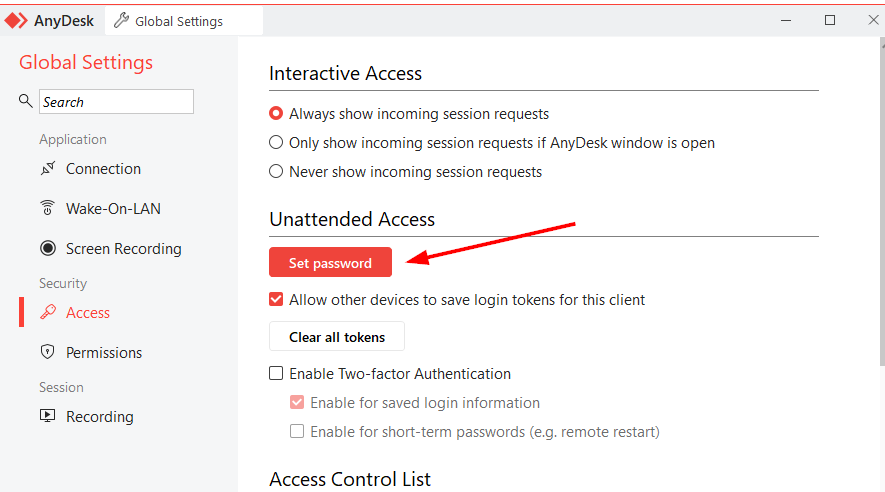
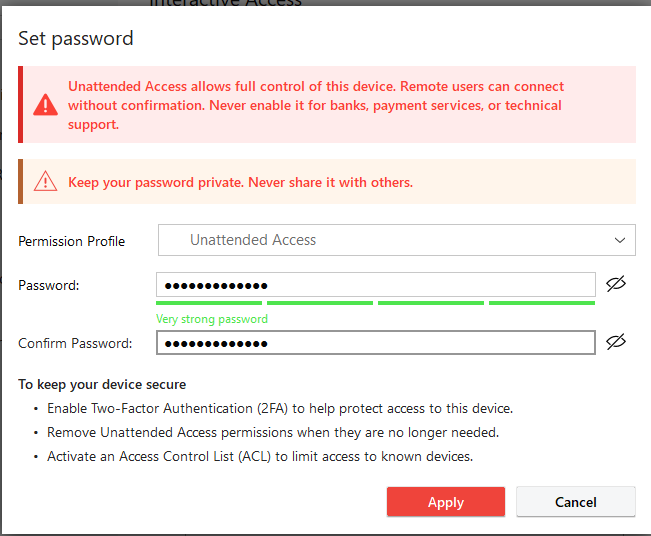
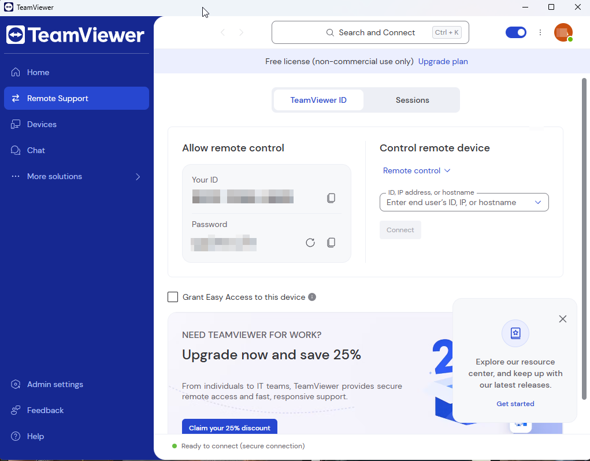
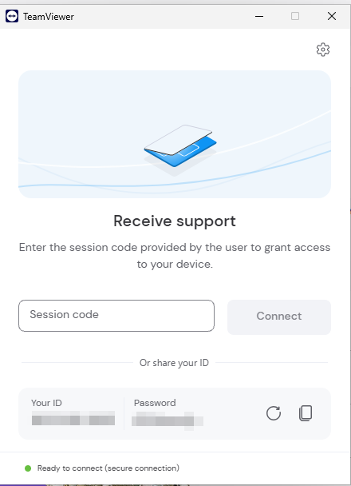

# 03-Installation and Setup Steps

## 1. Network Configuration (Bridged Adapter)

1. Shut down the VM.
2. In VirtualBox Manager: Select the VM -> **Settings** -> **Network** -> **Adapter 1** -> **Attached to: Bridged Adapter**, select the host's active physical adapter

3. Boot the VM, run `ipconfig` to confirm it received a LAN IP (not the `10.0.2.x` NAT range).


4. (Optional) Allow ICMP (Ping) in VM's firewall setting to let host Ping the VM to check the connection by paste the following command in the VM's terminal as an administrator
```bash
netsh advfirewall firewall add rule name="Allow ICMPv4-In" protocol=icmpv4:any,any dir=in action=allow
```
5. From the host, `ping 192.168.18.151` to confirm connectivity



---

## 2. Enabling RDP on the VM

1. **Settings** -> **System** -> **Remote Desktop** -> **Toggle On** (Requires Windows 11 Pro/Enterprise, Home edition cannot act as an RDP host)


2. Confirm the accout used has a password set (RDP rejects blank passwords).

3. Add the account to **Remote Desktop Users** if it isn't already an admin.

4. Verify the inbound firewall rule "Remote Desktop - User Mode (TCP-in)" Was auto-created.

---

## 3. Installing & Configuring AnyDesk

1. Install AnyDesk on both VM and the host from `https://anydesk.com/en/downloads/windows`

2. In AnyDesk VM : After install, go to top right corner and click **Settings**


3. In settings menu, go to **Access**, click **Set Password** for the **Unattended Access**, doing so the IT support can access without someone clicking "Accept" on the client side. This is mirror the real remote support setups


4. Insert secure password and click Apply



## 4. Installing & Configuring TeamViewer and QuickSupport

1. As host machine: Go to `teamviewer.com/download` and download **TeamViewer**

2. Install normally

3. Create an account, if done correctly, it will display a main menu which would look like this:


4. As VM client: to install **QuickSupport** go to `teamviewer.com/download` and download the installer

5. Run the `.exe` file, if run successfully the main UI should look like this:

