# 04-Simulated Support Scenarios

## Case 1 - "No Internet" (Via RDP)

### Simulated Ticket

> "Hey, my internet suddenly stopped working, I can't open any websites"

---

### Fault Simulation (on the client VM)

1. Open **Network Connections** by pressing **Windows Button** + **R** and type `ncpa.cpl` and press **Enter**
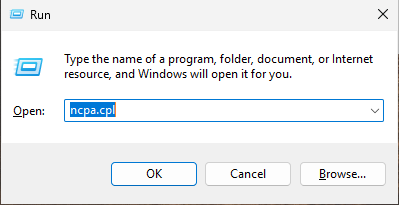

2. Right-click your adapter -> **Properties** -> **Internet Protocol Version 4 (TCP/IPv4)** -> **Properties**
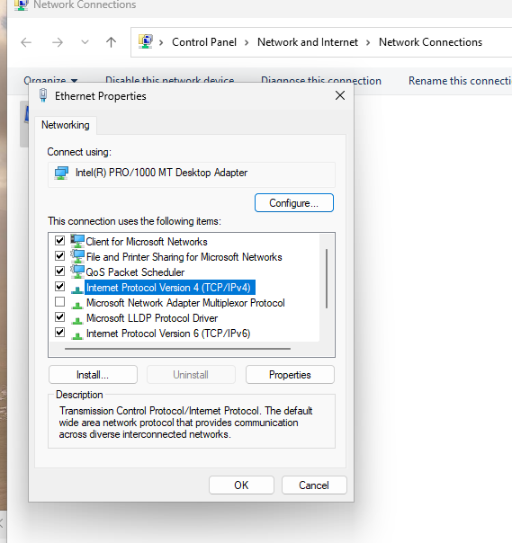

3. Set the default gateway and preferred DNS Server to a wrong IP addresses
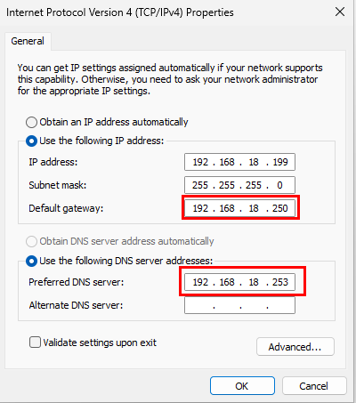

4. After clicking **OK**, test by pinging google DNS (8.8.8.8) Server to check internet connection, if it says "Destination host unreachable" means the misconfiguration has been successful

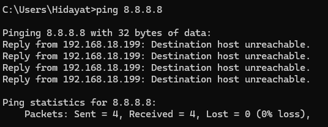

### Remote Support Simulation

1. Connect from the host via RDP (`mstsc`)  using the VM's LAN IP and the client's Windows credentials
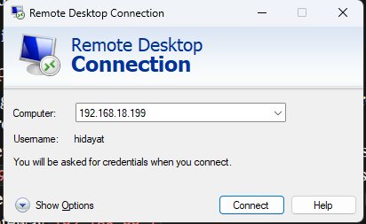

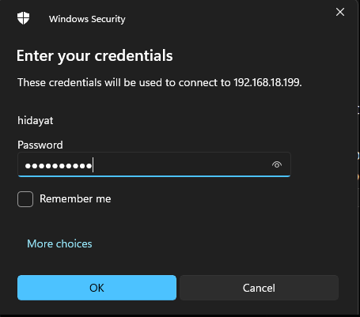

2. Reopen **Network Connections** -> **TCP/IPv4 Properties**

3. Run `ipconfig` to identify the correct gateway, and reset DNS to a known good server (`8.8.8.8`)
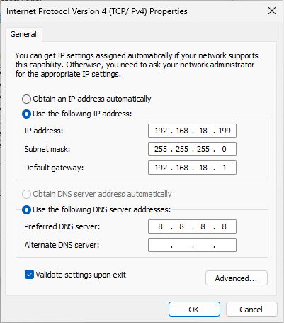

4. Verify the fix by sending ping to `8.8.8.8`

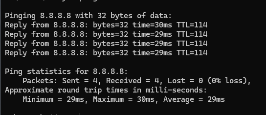

> **Tool used** : RDP (unattended, direct LAN connection)

---

## Case 2 - "Can't Print Anything" (Via AnyDesk)

### Simulated Ticket:

>"I try to print a document and nothing happens, no error, just nothing"

### Fault Simulation (on the client VM)

1. Open **Services** (`services.msc`)

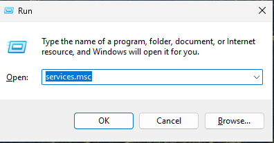

2. Find **Print Spooler** -> Right Click -> **Stop**
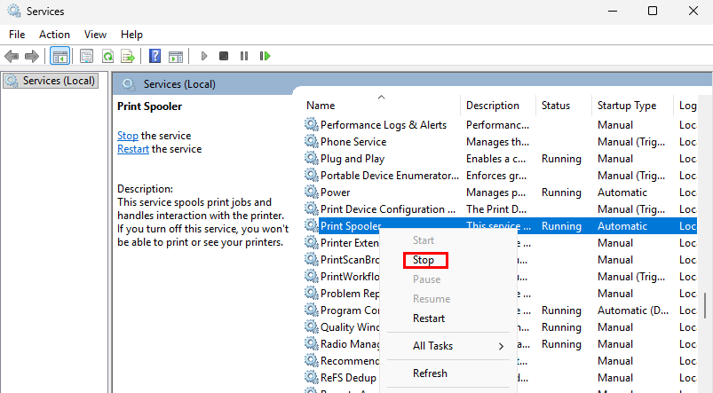

3. Set **Startup type** to **Disabled** so it doesn't recover on its own

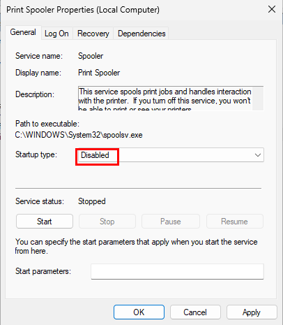

4. Confirm the break: Opening any print dialog shows an empty printer dropdown, stuck on "Loading preview"
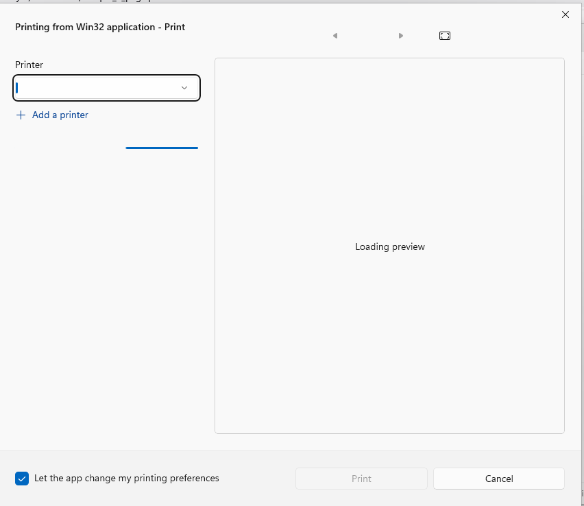

### Remote Support Simulation:

1. Connect from the host via AnyDesk, entering the client Remote Address ID and unattended-access password
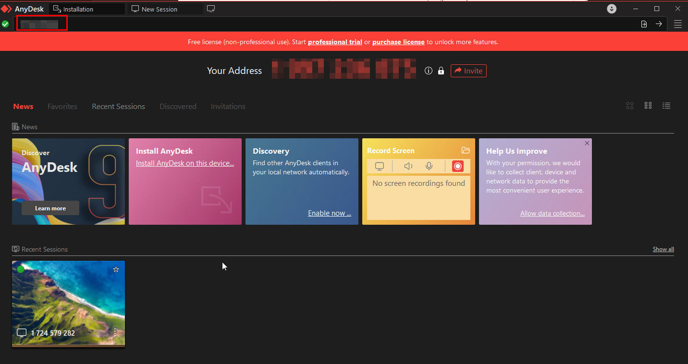

2. Check **Print Spooler** status in `service.msc`, confirmed stopped/disabled (root cause).
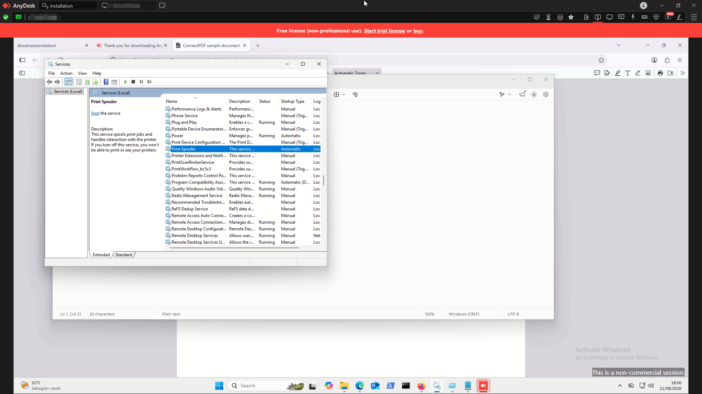

3. Set **Startup type** back to **Automatic** and **Start** the service.

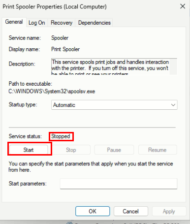

4. Confirm resolution weith the end-user via AnyDesk built0in chat feature
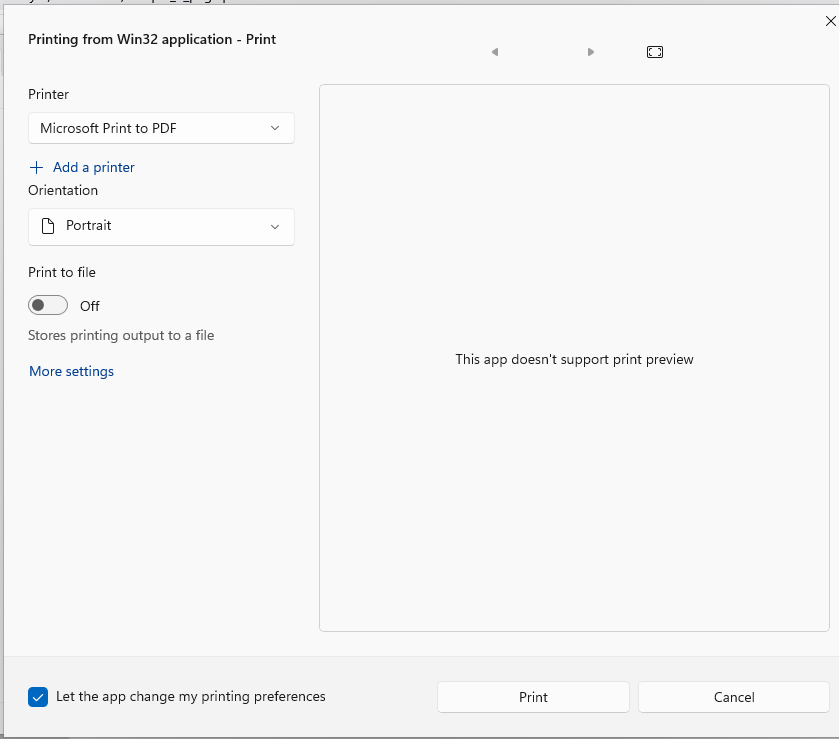
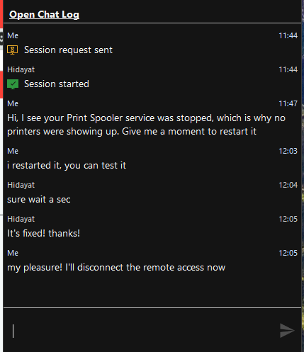

---

## Case 3 - "Computer Is Slow to Boot" (via TeamViewer QuickSupport)

### Simulated Ticket:

>"My laptop has been super low to boot the past few days"

### Fault Simulation (on the client VM):

1. Press `Win + R` -> `shell:startup` -> Enter, to open the user Startup folder

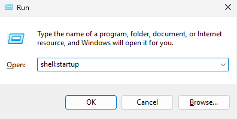

2. Create shortcuts pointing to lightweight built-in apps (e.g., `mspaint.exe`, `calc.exe`), duplicating a few for realism.
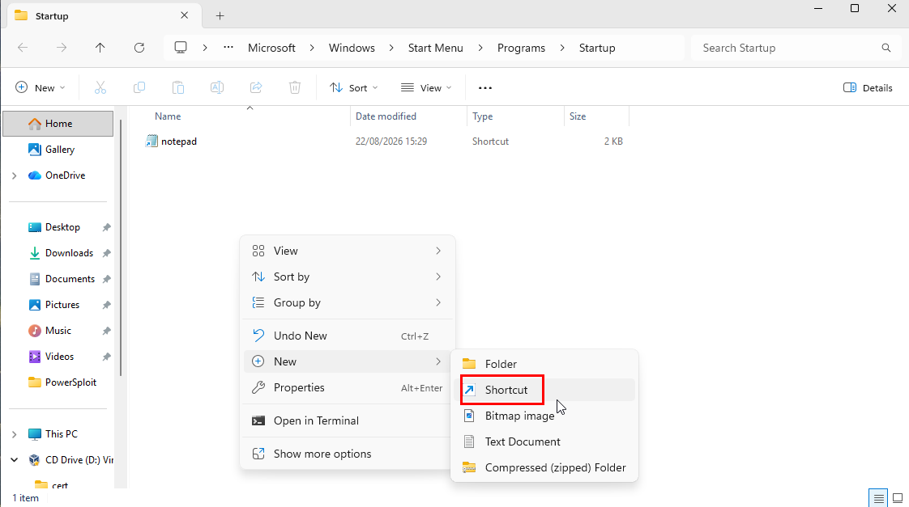 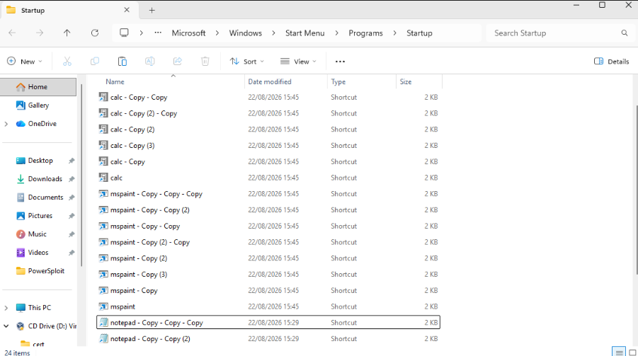

3. Restart the VM, multiple windows now auto-launch at login, producing a cluttered, slow feeling boot.
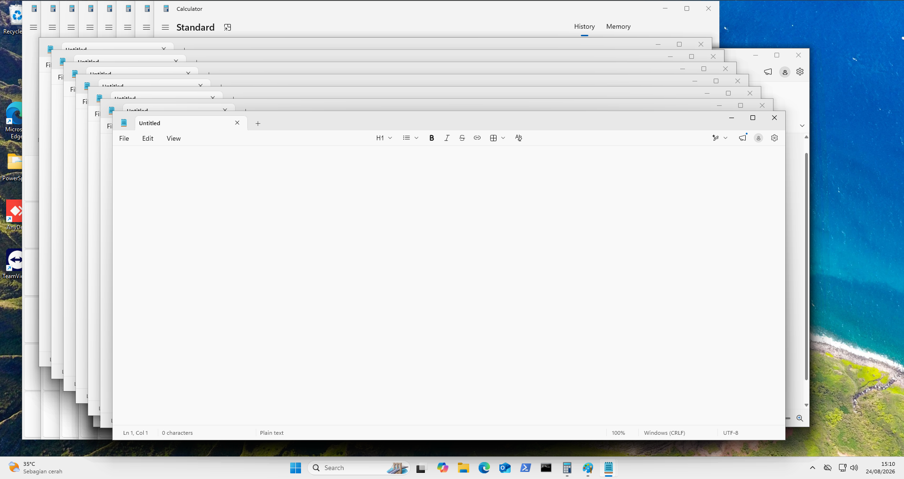

### Remote Support Simulation:

1. On the VM, launch **TeamViewer QuickSupport** to generate a fresh session ID and password (no persistent unattended access, this models an ad-hoc, attended session where the end-user has to be present to relay credentials).

2. Connect from the host's full **TeamViewer**
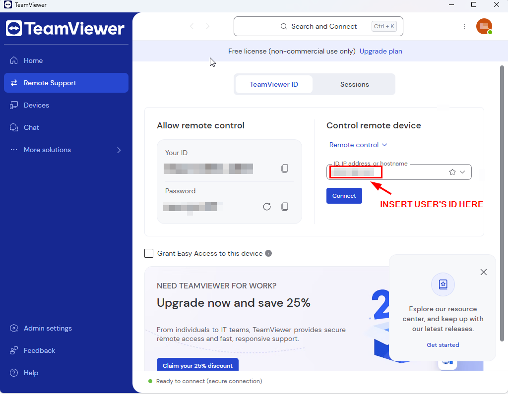

3. To diagnose the source of the problem, open **Task Manager** -> **Startup Apps**, sort by Startup impact, the dummy entries appear as **Enabled**
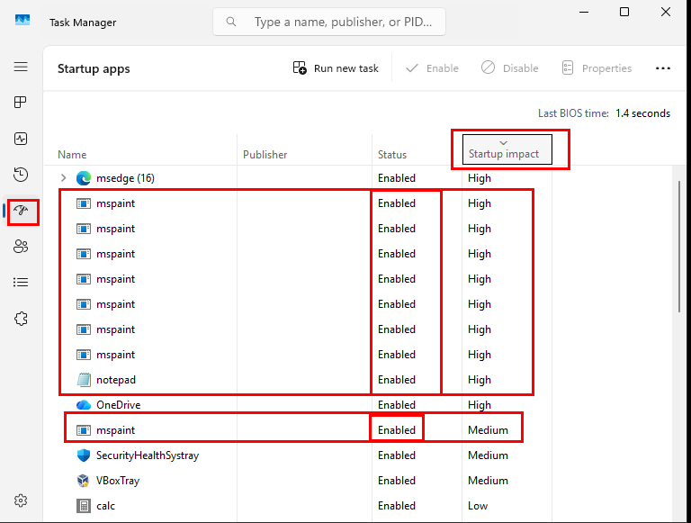

4. **Fix (Task Manager)**: disable each dummy entry (or delete the shortcuts from `shell:startup` directly)
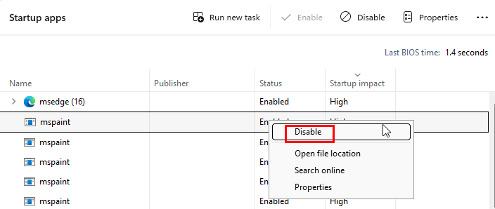

5. Restart the VM to verify a clean boot
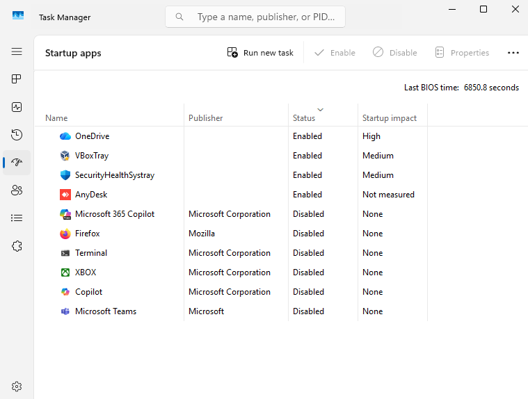

### Alternative / More Thorough Diagnosis Using Sysinternals Autoruns:

Task Manager only surfaces the most common autostart locations (Startup folder, Run registry keys). **Autoruns** goes further, covering registry Run keys across multiple hives, Scheduled Tasks, browser extensions, shell extensions, and more. The locations real malware and bundled junk software actually prefer to hide in. This is professional-grade tool for this kind of diagnosis in real IT Environment.

1. Reconnect via **QuickSupport** 

2. Download **Autoruns** from `https://learn.microsoft.com/sysinternals/downloads/autoruns` 
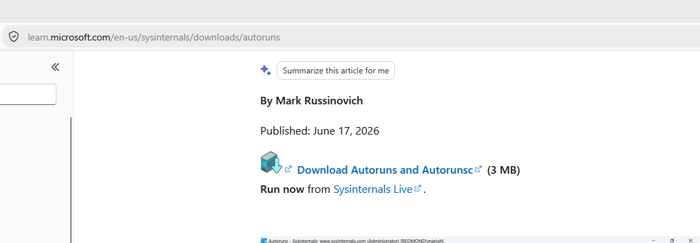

3. Run `Autoruns64.exe` as Administrator.

4. Click **Logon** tab specifically, this is where Startup folder + Run key entries live.

5. The dummy shortcuts (Notepad, calc, Paint shortcuts) will appear here, listed with their target paths, which can be unchecked to stop them from opening after reboot.
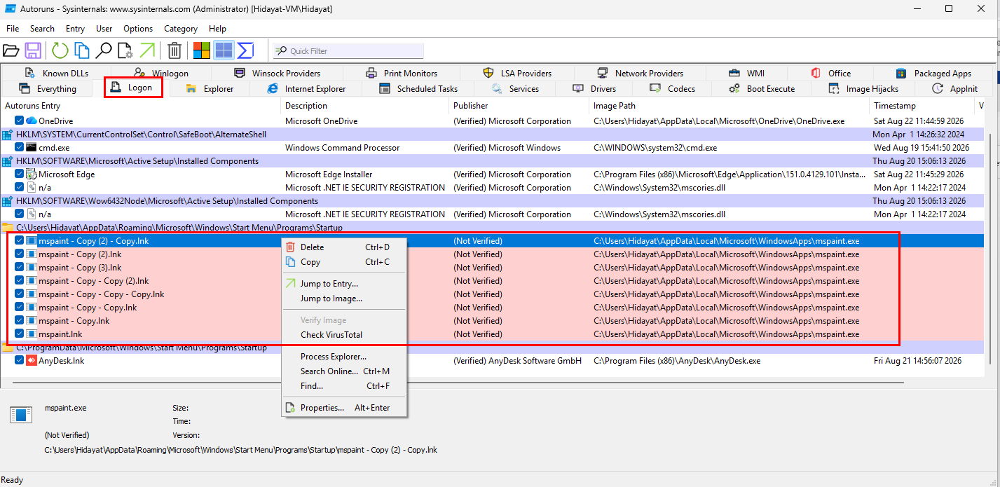

6. Restart the VM to confirm a clean boot with no unwanted auto-launches.

**Tool Used**: TeamViewwer QuickSupport (atteded, ad-hoc access) + Autoruns (Sysinternals) for diagnosis